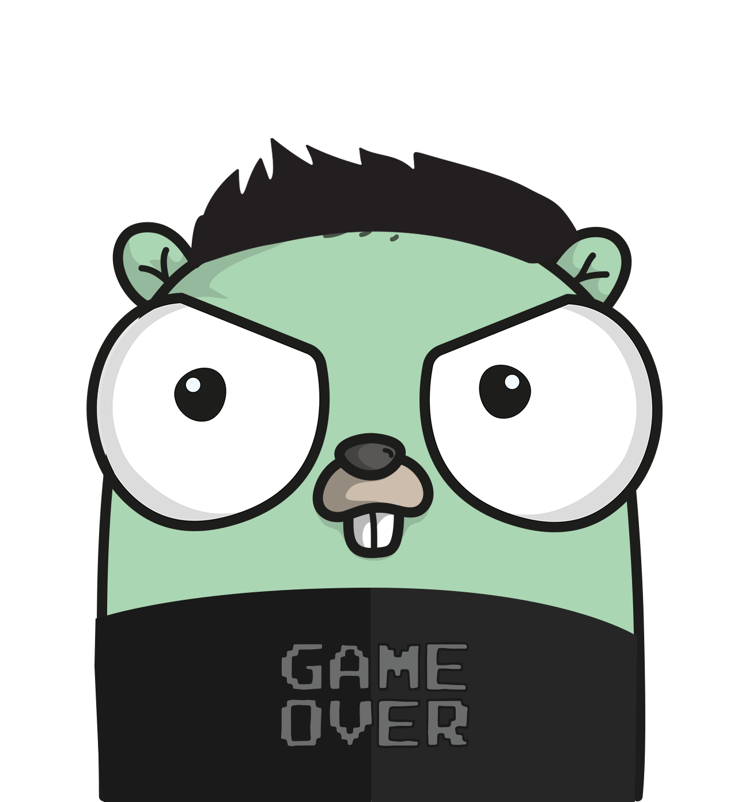

# GoTrader bot

Project to create a trade bot for bitmex trade platform.

[](https://goreportcard.com/report/github.com/thiago-scherrer/gotrader) [](https://travis-ci.org/thiago-scherrer/gotrader)
[](https://godoc.org/github.com/thiago-scherrer/gotrader)



## Requirements

- docker => 18.09.2
- docker-compose => 1.23.2
- bitmex account

## How it works

This robot still under construction. Its purpose is to automate a rule created by the trader. It's not a money machine ...

## Caution

This robot does not guarantee anything, it may not even work properly. You can lose money with it! Test the robo in the test network first.

You have been warned.

But if you have good results, share the logic =)

And Don't panic!

## Enabled

- Creating order, buying and selling
- Use of leverage
- Send messages to matrix.org
- Able to use modified rules

## Supported Contracts

- XBTUSD
- ETHUSD

## Runing with docker

Go to the config folder and then, copy **config-example.yml** to the **config.yml**. Add your settings to the file and then, go back to the root dir and run *docker-compose*:

```bash
docker-compose build
```

After *test* and *build*, run the bot (background):

```bash
docker-compose up -d
```

You can see the logs with *docker logs* command, like:

```bash
docker logs -f gotrader_runner_1
```

To stop the robot, run:

```bash
docker-compose down
```

## Runing local

Download the example configuration file, and after this, change the *config.yml* with your configurations:

```bash
wget https://raw.githubusercontent.com/thiago-scherrer/gotrader/master/configs/config-example.yml -O config.yml
```

Get the bot:

```bash
go get github.com/thiago-scherrer/gotrader/cmd/gotrader
```

Run the bot like:

```bash
$GOPATH/bin/gotrader config config.yml
```

## Logic

The acual logic can be changed on *internal/logic/*.

## TO-DO

- [ ] best log control
- [ ] cancel an order that has not been executed for X time
- [ ] more documentation

## References

- [bitmex api](https://www.bitmex.com/api/explorer/)
- [docker-compose install](https://docs.docker.com/compose/install/)
- [matrix doc](https://matrix.org/docs/spec/client_server/latest#sending-events-to-a-room)
- [goreportcard](https://goreportcard.com/)
- [gopherize](https://gopherize.me)
- [go-yaml](https://github.com/go-yaml/yaml)
- [project-layout](https://github.com/golang-standards/project-layout)
